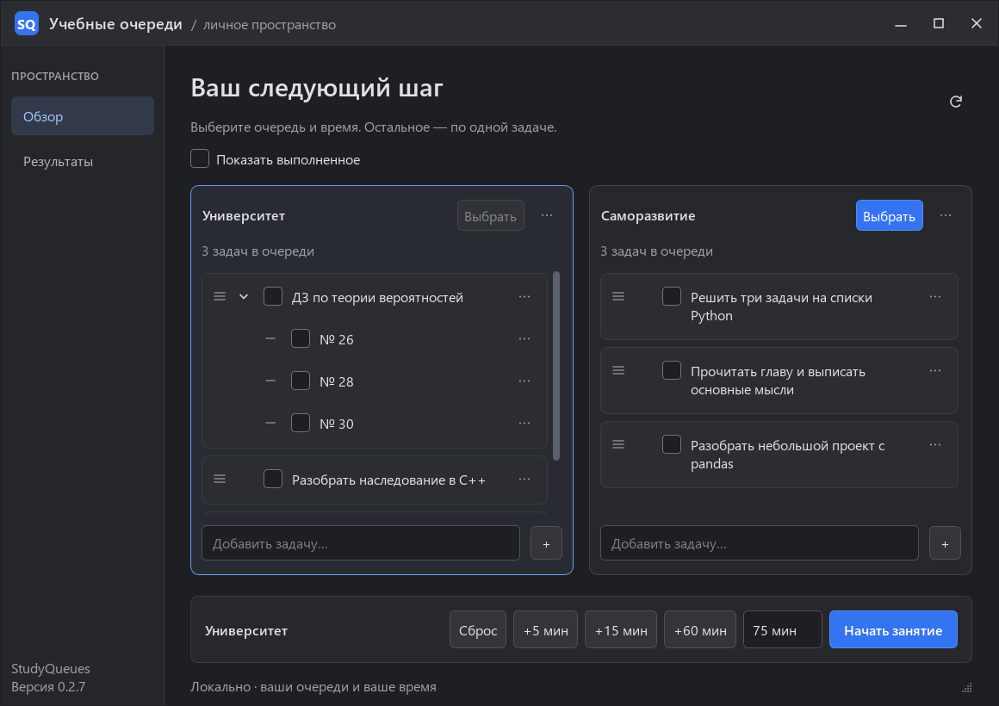
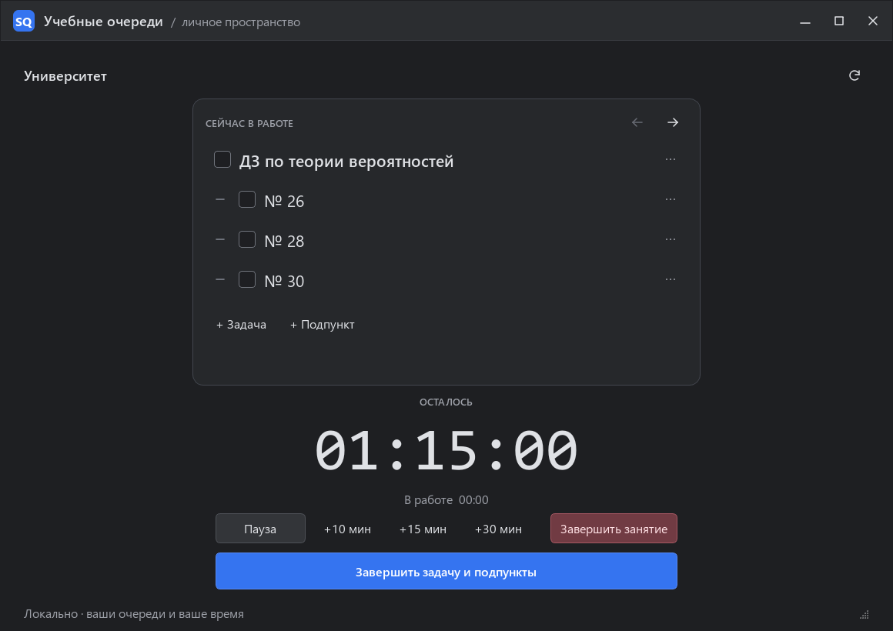
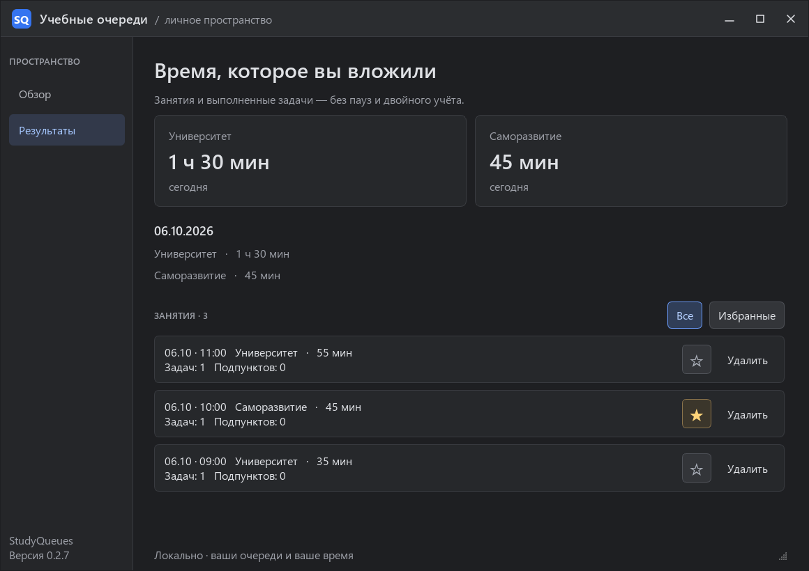

<div align="center">
  
  <h1>StudyQueues</h1>
  <p><strong>Учебные очереди. Сосредоточьтесь на следующей задаче.</strong></p>
  <p>Локальное приложение для Windows: Markdown-задачи, таймер и история занятий.</p>
  <p>
    <a href="https://github.com/svetonosniy88/StudyQueues/releases"></a>
    
    
    <a href="LICENSE"></a>
    <a href="https://github.com/svetonosniy88/StudyQueues/actions/workflows/tests.yml"></a>
  </p>
  <p><a href="#установка">Установка</a> · <a href="docs/USER_GUIDE.md">Руководство</a> · <a href="https://github.com/svetonosniy88/StudyQueues/releases/latest">Последний выпуск</a> · <a href="https://github.com/svetonosniy88/StudyQueues/issues/new/choose">Обратная связь</a></p>
</div>



StudyQueues помогает организовать учёбу и самостоятельную работу. Составьте очередь, выберите длительность и начните занятие: рабочий экран покажет текущую задачу с подпунктами и таймер. Отмечайте выполненное, продлевайте занятие и возвращайтесь к своим результатам.

Задачи хранятся в обычных Markdown-файлах. Их можно редактировать в приложении, Obsidian или другом текстовом редакторе. Настройки и история остаются на вашем компьютере; аккаунт для работы не нужен.

## Возможности

| | Что можно делать |
| --- | --- |
| **Две очереди** | Разделять университетские задачи и саморазвитие, подключать свои Markdown-файлы. |
| **Понятный обзор** | Добавлять свежие задачи сверху, раскрывать подпункты и менять порядок перетаскиванием. Длинные очереди показываются группами по 15. |
| **Рабочий экран** | Видеть одну задачу со всеми подпунктами, редактировать текст и добавлять задачи прямо во время занятия. |
| **Гибкое время** | Набрать длительность кнопками `+5`, `+15`, `+60` или вручную. Поставить паузу, продлить план или завершить занятие раньше. |
| **Работа сверх плана** | После нуля таймер продолжает учитывать время. Задача остаётся открытой до вашего решения. |
| **История занятий** | Смотреть отработанное время и выполненные пункты, сохранять лучшие занятия в избранном, удалять ошибочные записи. |
| **Сохранность данных** | Резервная копия перед записью, проверка внешних изменений и восстановление незавершённого занятия на паузе. |

| Занятие | Результаты |
| --- | --- |
|  |  |

*Скриншоты сделаны на демонстрационных задачах и истории.*

## Установка

Сейчас приложение распространяется **из исходников**. Нужны Windows и [Python 3.12, 64-bit](https://www.python.org/downloads/windows/); установка зависимостей требует интернета. Готового EXE в этом выпуске нет.

1. Скачайте **Source code (zip)** со [страницы последнего выпуска](https://github.com/svetonosniy88/StudyQueues/releases/latest) и распакуйте архив в отдельную папку.
2. Запустите **Setup.cmd**. Он создаст окружение `.venv` и установит зависимости.
3. Откройте **Start.cmd**. При первом запуске появятся две пустые очереди — добавьте задачи или выберите свои файлы через `⋯` у заголовка очереди.

Для ярлыка с иконкой SQ выполните из PowerShell в папке приложения:

```powershell
powershell -NoProfile -ExecutionPolicy Bypass -File .\scripts\CreateShortcut.ps1
```

Созданный `StudyQueues.lnk` можно перенести на рабочий стол.

<details>
<summary>Установка через терминал</summary>

```powershell
git clone https://github.com/svetonosniy88/StudyQueues.git
cd StudyQueues
py -3.12 -m venv .venv
.\.venv\Scripts\python.exe -m pip install -e .
.\.venv\Scripts\python.exe -m studyqueues
```

Если Python Launcher `py` не установлен, используйте `python` вместо `py -3.12`, убедившись, что это Python 3.12. PySide6 текущего выпуска поддерживает Python младше 3.15; тесты проекта запускаются на 3.12.

</details>

## Первое занятие

1. Добавьте задачи в нужную очередь. Для составной задачи добавьте подпункты через меню `⋯`.
2. Нажмите название очереди или **«Выбрать»**. Синяя рамка показывает выбранную очередь.
3. Наберите время: например, `+15` и `+5` дают 20 минут. Нажмите **«Начать занятие»**.
4. Отмечайте пункты квадратиком; нажмите на текст, чтобы его отредактировать. Стрелки в заголовке позволяют вернуться к предыдущей задаче или пропустить текущую.
5. **«Завершить задачу и подпункты»** отмечает весь блок выполненным. **«Завершить занятие»** сохраняет фактическое время и открывает результаты. Это разные действия.

Пауза не засчитывается. Когда плановое время закончится, учёт продолжится сверх плана. Подробности — в [руководстве пользователя](docs/USER_GUIDE.md).

## Ваши файлы и данные

По умолчанию приложение использует `%LOCALAPPDATA%\StudyQueues`. В этой папке находятся настройки, история, снимок незавершённого занятия, резервные копии и папка `queues` с первоначальными очередями. Подключённые внешние Markdown-файлы остаются на своих местах.

Можно указать отдельный профиль:

```powershell
.\.venv\Scripts\python.exe -m studyqueues --data-dir "D:\StudyQueues-data"
```

Чтобы сохранить одну историю, запускайте приложение с одной и той же папкой данных. При обновлении заменяйте исходники, сохраняя профиль и Markdown-очереди.

```markdown
# Университет

- [ ] Разобрать тему и решить упражнения
    - [ ] Прочитать конспект
    - [ ] Решить № 26
- [x] Уже выполненная задача
```

Поддерживается один уровень подпунктов с **четырьмя пробелами**. [Формат Markdown и внешние правки](docs/MARKDOWN.md).

## Демонстрация и разработка

Демонстрационный режим создаёт отдельные копии примеров и не подключает обычный профиль:

```powershell
.\.venv\Scripts\python.exe -m studyqueues --demo
```

Приложение написано на **Python + PySide6 / Qt Widgets**. Проверки и работа с кодом описаны в [CONTRIBUTING.md](CONTRIBUTING.md); изменения версий — в [CHANGELOG.md](CHANGELOG.md).

Нашли ошибку или придумали улучшение? [Создайте обращение](https://github.com/svetonosniy88/StudyQueues/issues/new/choose) с описанием сценария. Для примера используйте демонстрационные задачи.

## Лицензия

StudyQueues распространяется под лицензией [MIT](LICENSE). Лицензии сторонних компонентов перечислены в [THIRD_PARTY_NOTICES.md](THIRD_PARTY_NOTICES.md).
